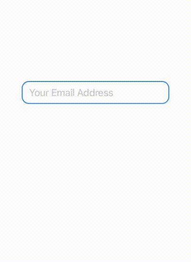

# FloatingTextField

[](https://img.shields.io/badge/Swift-5.1_5.2_5.3_5.4-Orange?style=flat-square)
[](https://img.shields.io/badge/Platforms-macOS_iOS_tvOS_watchOS_Linux_Windows-Green?style=flat-square)

Attractive FloatingTextField Using SwiftUI


- [Requirements](#requirements)
- [Usage](#usage)
- [Sample](#sample)
- [Contributors](#contributors)
- [License](#license)


## Requirements

| Platform | Minimum Swift Version | Status |
| --- | --- | --- |
| iOS 15.0+ | 5.0 | Tested |

## Usage

``` swift

import SwiftUI

@main
struct FloatingTextFieldApp: App {
    
    @State var text: String = ""
    
    var body: some Scene {
        WindowGroup {
            FloatingTextField(title: "Your Email Address", text: $text)
                .frame(width: 350, height: 60, alignment: .center)
        }
    }
}

```

## Sample



## Contributors

Feel free to share your ideas or any other problems. Pull requests are welcomed.

## License

ViewMaker is released under an MIT license. See [LICENSE](https://github.com/kiarashvosough1999/FloatingTextField/blob/master/LICENSE) for more information.
